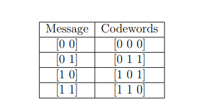

In Experiment-1, we provided a brief introduction to block codes and also defined a class of block codes, linear block codes. For rest of the experiments in this virtual lab we shall now focus on linear block codes.  

In Experiment-1, we also introduced two simple classes of linear block codes, repetition and single parity check codes. In this experiment, we shall focus on the theory general linear block codes. We shall study two important matrices associated with the given linear block code,  generator matrix (denoted by $G$) and parity check matrix (denoted by $H$). 

The theory associated with Experiment-2 is divided into two parts:
 
(1) Generator Matrix
 
(2) Parity Check Matrix

## 1 Generator matrix

Recall that a linear block code $\mathcal{C}(n,k)$ is a $k$-dimensional subspace of the vector space $\mathbb{F}_2^n$ (see Experiment-1, Part-2 Theory).
For any linear block code, there exists a matrix $G \in \mathbb{F}_2^{k \times n}$ such that the codeword $\mathbf{v} \in \mathbb{F}_2^n$ corresponding to the message $\mathbf{m} \in \mathbb{F}_2^k$ is given by
$\mathbf{m} G = \mathbf{v}$, i.e.,

$$\begin{align*}
\underbrace{\begin{bmatrix} v_1 & v_2 & \ldots & v_{n} \end{bmatrix}}_{\mathbf{v}} = 
\underbrace{\begin{bmatrix} m_1 & m_2 & \ldots & m_{k} \end{bmatrix}}_{\mathbf{m}} 
\times 
\underbrace{\begin{bmatrix} 
g_{1,1} & g_{1,2} & \ldots & g_{1,n}\\ 
g_{2,1} & g_{2,2} & \ldots & g_{2,n}\\ 
\vdots \\
g_{k,1} & g_{k,2} & \ldots & g_{k,n}
\end{bmatrix}}_{G}  .
\end{align*}$$

This matrix $G$ is called as a generator matrix of
the given linear block code. Note that the given code is completely
described the generator matrix since by considering all possible message
vectors in $\mathbb{F}_2^k$, one can obtain the entire codebook.
Let us consider some examples.
- Example-1: For example for REP-$3$ code, the codewords corresponding to messages
$0$ and $1$ can be obtained as 
$$\begin{aligned}  
\begin{bmatrix} 0 & 0 & 0 \end{bmatrix} &= [0] \times \begin{bmatrix} 1 & 1 & 1\end{bmatrix}   \\ 
\begin{bmatrix} 1 & 1 & 1 \end{bmatrix} &= [1] \times \begin{bmatrix} 1 & 1 & 1\end{bmatrix},
 \end{aligned}$$
where it can be seen that the matrix
$G  = \begin{bmatrix} 1 & 1 & 1\end{bmatrix}$ is a generator matrix.

- Example-2: For $(3,2)$ SPC code, the messages and the
    corresponding codewords are given below:
    
    

    These codeword can be written as 
    $$\begin{align*}
      \begin{bmatrix} 0 & 0 & 0 
      \end{bmatrix} &=\begin{bmatrix} 0 & 0 \end{bmatrix} \times 
      \begin{bmatrix} 1 & 0 & 1 \\ 0 & 1 & 1\end{bmatrix}   \\
      \begin{bmatrix} 0 & 1 & 1 \end{bmatrix} &=\begin{bmatrix} 0 & 1 \end{bmatrix} \times \begin{bmatrix} 1 & 0 & 1 \\ 0 & 1 & 1
      \end{bmatrix}  \\
      \begin{bmatrix} 1 & 0 & 1 \end{bmatrix} 
      &=\begin{bmatrix} 1 & 0 \end{bmatrix} \times \begin{bmatrix} 1 & 0 & 1 \\ 0 & 1 & 1\end{bmatrix}   \\
      \begin{bmatrix} 1 & 1 & 0 \end{bmatrix} &=
      \begin{bmatrix} 1 & 1 \end{bmatrix} \times \begin{bmatrix} 1 & 0 & 1 \\ 0 & 1 & 1\end{bmatrix} ,
      \end{align*}$$
     where the matrix $G$ = $$\begin{bmatrix} 1 & 0 & 1 \\ 0 & 1 & 1\end{bmatrix}$$ is a generator matrix of $(3,2)$ SPC code.

- Example-3: Consider the following generator matrix.
$$\begin{align*}
G = \begin{bmatrix} 
1 & 0 & 0 & 1 \\ 
0 & 1 & 1 & 1  
\end{bmatrix} 
\end{align*}
$$
One can obtain the linear block code generated by this generator matrix by obtaining all possible codewords corresponding to all possible messages in $\mathbb{F}_2^2$ as follows.
$$\begin{align*}
\begin{bmatrix} 0 & 0 \end{bmatrix} \times 
\begin{bmatrix} 
1 & 0 & 0 & 1 \\ 
0 & 1 & 1 & 1  
\end{bmatrix}   
&= \begin{bmatrix} 0 & 0 & 0 & 0 \end{bmatrix} \\
\begin{bmatrix} 1 & 0 \end{bmatrix} \times 
\begin{bmatrix} 
1 & 0 & 0 & 1 \\ 
0 & 1 & 1 & 1  
\end{bmatrix}   
&= \begin{bmatrix} 1 & 0 & 0 & 1 \end{bmatrix} \\
\begin{bmatrix} 0 & 1 \end{bmatrix} \times 
\begin{bmatrix} 
1 & 0 & 0 & 1 \\ 
0 & 1 & 1 & 1  
\end{bmatrix}   
&= \begin{bmatrix} 0 & 1 & 1 & 1 \end{bmatrix} \\
\begin{bmatrix} 1 & 1 \end{bmatrix} \times 
\begin{bmatrix} 
1 & 0 & 0 & 1 \\ 
0 & 1 & 1 & 1  
\end{bmatrix}   
&= \begin{bmatrix} 1 & 1 & 1 & 0 \end{bmatrix}.
\end{align*}$$

Thus the linear block code $\mathcal{C}(4,2)$ generated by this generator matrix will be
$$\begin{align*}
\mathcal{C}(4,2) = 
\left\{
\begin{bmatrix} 0 \\ 0 \\ 0 \\ 0  \end{bmatrix},
\begin{bmatrix} 1 \\ 0 \\ 0 \\ 1  \end{bmatrix},
\begin{bmatrix} 0 \\ 1 \\ 1 \\ 1  \end{bmatrix},
\begin{bmatrix} 1 \\ 1 \\ 1 \\ 0  \end{bmatrix}
\right\}.
\end{align*}$$

- Example-4: Consider the following generator matrix.
$$\begin{align*}
G = \begin{bmatrix} 
1 & 0 & 1 & 1 & 0 \\ 
0 & 1 & 0 & 1 & 1 \\
0 & 0 & 0 & 1 & 1 
\end{bmatrix} 
\end{align*}$$
It can be verified that the linear block code $\mathcal{C}(5,3)$ generated by this generator matrix will be 
$$\begin{align*}
\mathcal{C}(5,3) = 
\left\{
\begin{bmatrix} 0 \\ 0 \\ 0 \\ 0 \\ 0 \end{bmatrix},
\begin{bmatrix} 1 \\ 0 \\ 1 \\ 1 \\ 0 \end{bmatrix},
\begin{bmatrix} 0 \\ 1 \\ 0 \\ 1 \\ 1 \end{bmatrix},
\begin{bmatrix} 0 \\ 0 \\ 0 \\ 1 \\ 1 \end{bmatrix},
\begin{bmatrix} 1 \\ 1 \\ 1 \\ 0 \\ 1 \end{bmatrix},
\begin{bmatrix} 0 \\ 1 \\ 0 \\ 0 \\ 0 \end{bmatrix},
\begin{bmatrix} 1 \\ 1 \\ 1 \\ 1 \\ 0 \end{bmatrix}
\right\}.
\end{align*}$$

## 1.1 Obtaining a generator matrix from the given codebook

In Examples-3 and 4, we illustrated how to obtain linear block code corresponding to the given generator matrix. Let us now discuss how to obtain a generator matrix from the given linear block code $\mathcal{C}(n,k)$. Recall that a linear block code $\mathcal{C}(n,k)$ is a $k$-dimensional subspace of the vector space $\mathbb{F}_2^n$.   Let $\mathbf{g}_1, \mathbf{g}_2, \ldots, \mathbf{g}_k$ be a basis of this subspace (preliminaries about basis of a vector space are discussed in Experiment-1, Part-1 Theory). 
% 
Obtain a matrix $G \in \mathbb{F}_2^{k \times n}$ corresponding to this basis as follows

$$\begin{align}  
G = 
\begin{bmatrix}
\leftarrow & \mathbf{g}_1 & \rightarrow \\
\leftarrow & \mathbf{g}_2 & \rightarrow \\
 & \vdots &  \\
\leftarrow & \mathbf{g}_k & \rightarrow
\end{bmatrix}. 
\end{align}$$
 
 Note that the given code $$\mathcal{C}(n,k)=\hspace{0.01in}{span}\{\mathbf{g}_1, \mathbf{g}_2, \ldots, \mathbf{g}_k\}$$, i.e., the rows of the matrix $G$ defined in Eq. (1) *generate* (span) the linear block code $\mathcal{C}(n,k)$. Hence this matrix $G$ is termed as a *generator matrix*. Note that different bases of the vector space $$\mathcal{C}(n,k)$$ will correspond to a different generator matrix and hence a generator matrix for the given code is not unique.  

For Examples-3 and 4 it can be verified that the rows corresponding to the respective generator matrices does form a basis for the respective linear block codes. 

## 1.2 Systematic generator matrix

A linear block code $$\mathcal{C}(n,k)$$ is said to be systematic if every codeword $$\mathbf{v} \in \mathcal{C}(n,k)$$ can be written as
$$\begin{align*}  
\mathbf{v} = \begin{bmatrix} \mathbf{m} & \mathbf{p} \end{bmatrix},
\end{align*}$$
where $\mathbf{m} \in \mathbb{F}_2^k$ is the message corresponding to the codeword $\mathbf{v}$ and $\mathbf{p} \in \mathbb{F}_2^{n-k}$ is the vector corresponding to parity bits. It can be seen that Examples-1, 2, and 3 are systematic codes whereas Example-4 is not a systematic code. 

For a systematic code, it is possible to obtain a generator matrix that can be written as
$$\begin{align*}  
G = \begin{bmatrix} I_k & P \end{bmatrix},
\end{align*}$$
where $P$ is some matrix in $\mathbb{F}_2^{k \times n-k}$ and $I_k \in \mathbb{F}_2^{k \times k}$ is 
an identity matrix given by
 
$$\begin{align*}  
I_k = \begin{bmatrix} 
1 & 0 & \ldots & 0 \\
0 & 1 & \ldots & 0 \\
\vdots & \vdots & \ldots & \vdots \\
0 & 0 & \ldots & 1 
\end{bmatrix}.
\end{align*}$$
Note that an identity matrix $I_k$ is a diagonal matrix with $1$ as diagonal entries.

It can be verified that the generator matrices corresponding to Examples-1, 2, and 3 can be written as $G = \begin{bmatrix} I_k & P \end{bmatrix}$. For example, generator matrix of Example-2 can be written as
$$\begin{align} G = \begin{bmatrix} 
1 & 0 & 1 \\ 
0 & 1 & 1  
\end{bmatrix}
= \begin{bmatrix} I_2 & P\end{bmatrix}
\hspace{0.05in}{where} \hspace{0.05in}{} 
I_2 = \begin{bmatrix} 
1 & 0 \\ 
0 & 1  
\end{bmatrix}
\hspace{0.05in}{and} \hspace{0.05in}{} 
P = \begin{bmatrix} 
1 \\ 
1  
\end{bmatrix} .
\end{align}$$

Generator matrix of Example-3 can be written as
 
$$\begin{align}  
G = \begin{bmatrix} 
1 & 0 & 0 & 1 \\ 
0 & 1 & 1 & 1  
\end{bmatrix} 
= \begin{bmatrix} I_2 & P\end{bmatrix}  
I_2 = \begin{bmatrix} 
1 & 0 \\ 
0 & 1  
\end{bmatrix} 
\hspace{0.05in}{and} \hspace{0.05in}{} 
P^{\prime} = \begin{bmatrix} 
0 & 1 \\ 
1 & 1  
\end{bmatrix} .
\end{align}$$

## 2 Parity check matrix

A linear block code can also be defined using a parity check matrix $H\in \mathbb{F}_2^{n-k \times n}$ as follows.
#### Definition 1  *Linear block code $\mathcal{C}(n,k)$): For the given parity check matrix $H\in \mathbb{F}_2^{n-k \times n}$, the linear block corresponding to it is defined as the collection of all possible vectors $\mathbf{v} \in \mathbb{F}_2^n$ that satisfy the condition $\mathbf{v}H^T = \mathbf{0}$, i.e.,*
$$\begin{align*}
\mathcal{C}(n,k) = \left\{ \mathbf{v} \in \mathbb{F}_2^n \hspace{0.05in}{such}
\hspace{0.05in}{} {that}\hspace{0.05in}{} \mathbf{v}H^T = \mathbf{0} \right\}. 
\end{align*}$$

It can be seen from Definition 1 that, one can verify whether the given vector is a codeword or not using a parity check matrix. 
Similar to generator matrix, a parity check matrix also need not be unique. 

We shall next define the dual code $\mathcal{C}^{\perp}(n,n-k)$ of the linear block code $\mathcal{C}(n,k)$.

#### Definition 2 *(Dual code): Consider a linear block code $\mathcal{C}(n,k)$ with parity check matrix $H$. Let $\mathcal{C}^{\perp}(n,n-k)$ be the linear block obtained by choosing $H$ as its generator matrix. Then $\mathcal{C}^{\perp}(n,n-k)$ is said to be the dual code of $\mathcal{C}(n,k)$, i.e., for any $\mathbf{v} \in \mathcal{C}^{\perp}(n,k)$ and $\mathbf{w} \in \mathcal{C}^{\perp}(n,n-k)$ we have $\mathbf{v}\mathbf{w}^T = 0$.*

For the systematic code with generator matrix $G =\begin{bmatrix} I_k & P \end{bmatrix}$, parity check matrix $H$ can be obtained as

$$\begin{align*} 
H = \begin{bmatrix} I_{n-k} & P^T \end{bmatrix},
\end{align*}$$

where $I_{n-k}$ denotes an identity matrix with $n-k$ rows and columns. For Example-2, parity check matrix can be obtained as (see Eq. (2))
$$\begin{align}
H = \begin{bmatrix} I_{n-k} & P^T \end{bmatrix}
= \begin{bmatrix} 
1 & 1 & 1  
\end{bmatrix}, 
\end{align}$$

where $P$ is defined in Eq. (2). For Example-3, parity check matrix can be obtained as (see Eq. (3))

$$\begin{align}
H = \begin{bmatrix} I_{n-k} & P^{\prime T} \end{bmatrix}
= \begin{bmatrix} 
1 & 0 & 0 & 1 \\ 
0 & 1 & 1 & 1  
\end{bmatrix},
\end{align}$$

where $P^{\prime}$ is defined in Eq. (3).

We shall now summarize some properties of parity check matrices.

- A generator matrix $G \in \mathbb{F}_2^{k \times n}$ and parity check matrix $H\in \mathbb{F}_2^{n-k \times n}$ associated with the given linear block code satisfy the following condition
$$\begin{align*} 
G H^T = \mathbf{0}.
\end{align*}$$
 
- Consider a linear block code $\mathcal{C}(n,k)$ with parity check matrix $H$. Then a vector $\mathbf{v} \in \mathbb{F}_2^n$ is a codeword in $\mathcal{C}(n,k)$ if and only if $\mathbf{v}H^T = \mathbf{0}$.
 
- Consider a linear block code $\mathcal{C}(n,k)$ with parity check matrix $H$. Then the minimum distance $d_{\min}$ (see  Experiment-1 Theory, Definition 13) of $\mathcal{C}(n,k)$ is equal to the smallest number of columns of $H$ that sum to $\mathbf{0}$. It can be verified using this property that the minimum distance $d_{\min}$ of code in Example-3 is equal to $2$ (see Eq. (3)).
